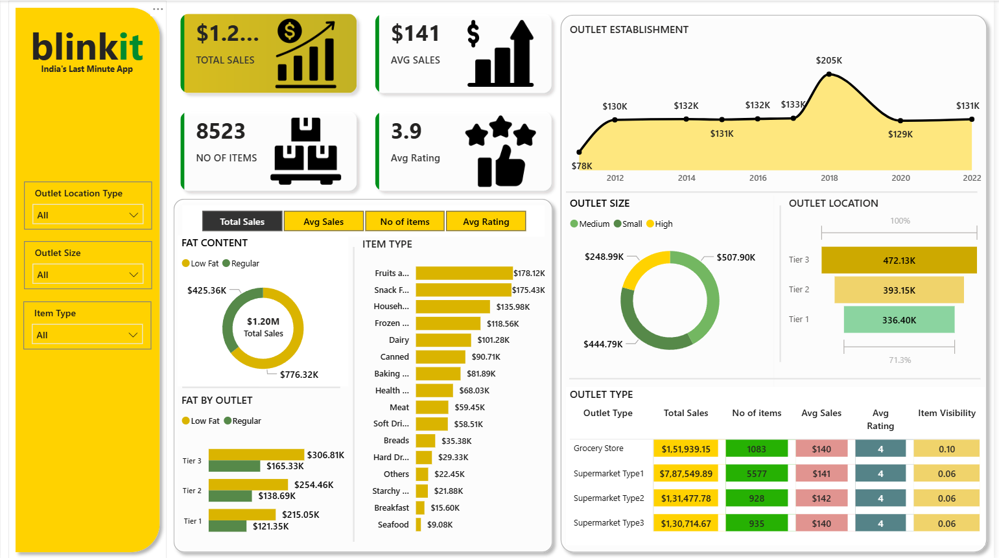

# 🛒 Blinkit Sales Analysis Dashboard | Power BI


---

# 📌 Project Overview

The **Blinkit Sales Analysis Dashboard** is an interactive Business Intelligence solution developed using **Power BI**, **DAX**, and **Power Query** to analyze retail sales performance, outlet characteristics, customer ratings, inventory distribution, and product category performance.

The dashboard transforms raw grocery sales data into meaningful business insights that support strategic decision-making for retail operations.

---

# 📸 Dashboard Preview

The dashboard provides an interactive overview of sales performance, outlet establishment trends, outlet size, product categories, customer ratings, and inventory insights.



---

# 🎯 Business Problem

Retail businesses generate large volumes of transactional data across different outlet types, product categories, and locations.

Business leaders need an interactive reporting solution to monitor performance and answer questions such as:

- Which outlet type generates the highest sales?
- Which item categories contribute the most revenue?
- How does outlet size affect sales?
- Which outlet locations perform best?
- How has outlet establishment changed over time?
- Which products receive higher customer ratings?

---

# 📂 Dataset Overview

| Property | Details |
|----------|----------|
| Dataset | BlinkIT Grocery Sales |
| Records | 8,523 Items |
| Dashboard Tool | Power BI |

### Dataset Includes

- Item Type
- Fat Content
- Item Visibility
- Item Weight
- Outlet Identifier
- Outlet Size
- Outlet Type
- Outlet Location
- Outlet Establishment Year
- Sales
- Rating

---

# 🛠️ Technologies Used

- Power BI Desktop
- Power Query
- DAX
- Data Modeling
- Microsoft Excel

---

# ⭐ Dashboard Highlights

- Interactive KPI Cards
- Dynamic Filters
- Sales Trend Analysis
- Outlet Performance Analysis
- Product Category Analysis
- Customer Rating Analysis
- Outlet Size Comparison
- Outlet Location Analysis

---

# 📈 Dashboard KPIs

- 💰 Total Sales
- 💵 Average Sales
- 📦 Number of Items
- ⭐ Average Rating

---

# 📊 Dashboard Features

### Executive KPIs

- Total Sales
- Average Sales
- Number of Items
- Average Customer Rating

### Interactive Visualizations

- Outlet Establishment Trend
- Outlet Size Distribution
- Outlet Location Analysis
- Item Type Performance
- Fat Content Analysis
- Outlet Type Comparison
- Interactive Filters
- Dynamic KPI Switching

---

# 📈 Key Business Insights

- Total Sales exceeded **$1.20M**.
- Fruits and Snack Foods generated the highest sales.
- Tier 3 outlets recorded the highest revenue.
- Medium-sized outlets contributed the largest share of sales.
- Regular fat products generated more revenue than low-fat products.
- Supermarket Type 1 achieved the highest overall sales.
- Customer ratings remained consistently high with an average rating of **3.9**.

---

# 💡 Business Recommendations

- Expand high-performing Tier 3 outlets.
- Increase inventory for high-selling product categories.
- Improve visibility for low-performing products.
- Focus marketing campaigns on top-performing outlet locations.
- Optimize outlet expansion using historical sales trends.

---

# 🔄 Project Workflow

```text
Raw Dataset
      │
      ▼
Power Query
(Data Cleaning)
      │
      ▼
Data Modeling
      │
      ▼
DAX Measures
      │
      ▼
Interactive Dashboard
      │
      ▼
Business Insights
```

---

# 💼 Skills Demonstrated

- Power BI
- DAX
- Power Query
- Data Cleaning
- Data Modeling
- Dashboard Design
- Data Visualization
- KPI Reporting
- Business Intelligence
- Retail Analytics

---

# 📁 Repository Structure

```text
Blinkit-Sales-Analysis-PowerBI
│
├── Dashboard
│   └── Blinkit_Sales_Analysis.pbix
│
├── Dataset
│   └── BlinkIT_Grocery_Data.xlsx
│
├── Images
│   └── Blinkit_Dashboard.png
│
├── README.md
└── LICENSE
```

---

# 🚀 Future Enhancements

- Sales Forecasting
- Customer Segmentation
- Profitability Analysis
- Regional Sales Dashboard
- Inventory Optimization
- Executive Retail Dashboard

---

# 💼 Resume Project Summary

Designed and developed an interactive Blinkit Sales Analysis Dashboard using Power BI, DAX, and Power Query to analyze grocery sales performance, outlet characteristics, inventory distribution, customer ratings, and product category trends. Built KPI reports and interactive dashboards to support data-driven retail decision-making.

---

# 👨‍💻 Author

## Hanumantha B

**Data Analyst | SQL | Python | Power BI | Excel**

### GitHub

https://github.com/hanumanth112

### LinkedIn

https://www.linkedin.com/in/hanumantha-b-673938374

---

## ⭐ If you found this project useful, consider giving it a Star on GitHub!
